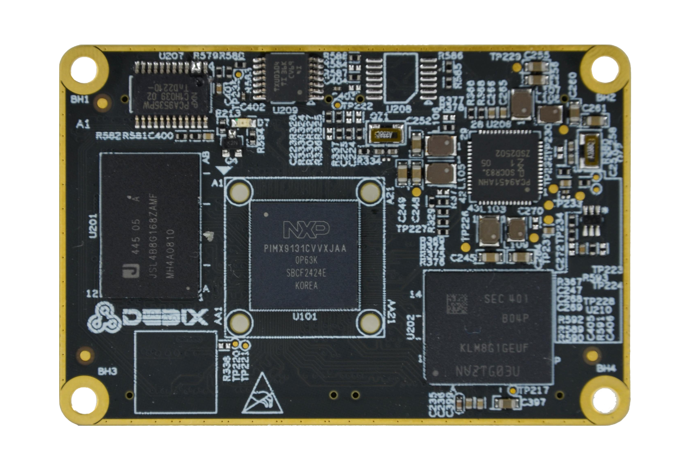
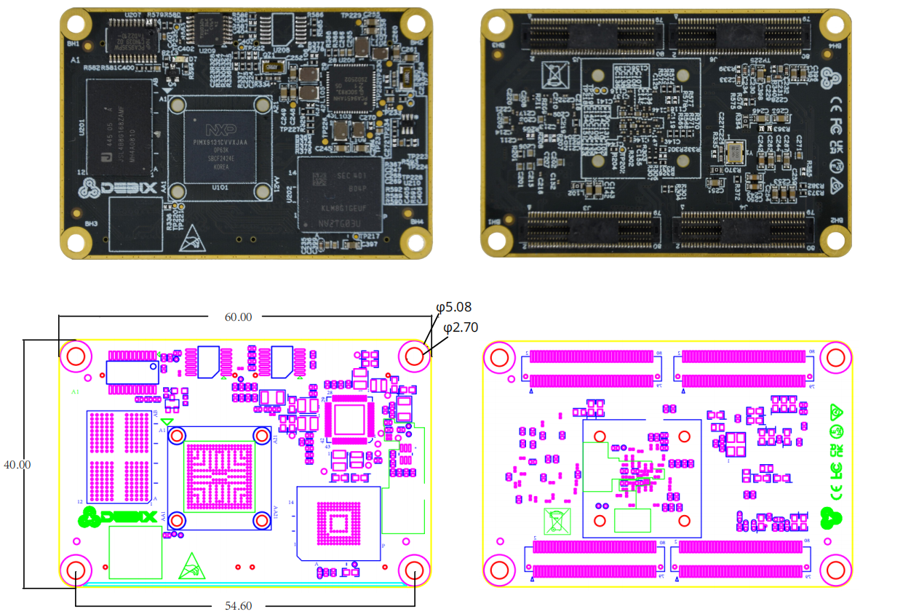

# DEBIX SOM C i.MX 91 Core Board
 

## Overview
DEBIX SOM C is a  cost-optimized  System-on-Module  based on  the  NXP  i.MX 91  processor, featuring  a single-core ARM  Cortex-A55  CPU  (up  to  1.4GHz)  and optimized for lightweight  embedded  systems.  By  integrating  the processor,  memory and  storage  into  a  compact  module, it  significantly  simplifies  carrier  board development and  accelerates  deployment in industrial  control,  IoT edge  devices, smart home and  other  low-power scenarios.

## Main Features
- **Industrial-grade Reliability:** Operates in extreme environments from -40°C~85°C, ideal for harsh industrial use cases.
- **Flexible System Integration:** Standardized board-to-board connectors accelerate carrier board development.
- **Low  Power  Operation:**  Single-core  Cortex-A55  (1.4GHz) focuses  on  essential tasks, eliminating unnecessary hardware complexity and power waste. Maximum power consumption as low as 1.24W.

 

 

### Specification:

| **System**       |             |
|------------------|-------------|
| CPU              | NXP i.MX 9131, 1 x Cortex-A55 @1.4GHz. The maximum power consumption is 1.24W (i.MX 91 series CPU optional) |
| Memory           | 1GB LPDDR4X (2GB optional) |
| Storage          | Onboard 8GB eMMC (16GB/32GB/64GB/128GB/256GB optional) |
| OS               | Yocto, Zephyr |
| **I/O Interfaces** |             |
| Gigabit Ethernet | Up to 2 x Independent MAC Gigabit Ethernet port |
| Display          | 1 x 24-bit-per-pixel parallel RGB, supports up to 1366x768@60Hz or 1280x800@60Hz |
| Camera           | 1 x 8-bit parallel CSI |
| Audio            | Up to 3 x SAI (synchronous audio interface) 1 x SPDIF OUT/IN 1 x PDM |
| USB              | 2 x USB 2.0 |
| UART             | Up to 8 x UART |
| I2C              | Up to 8 x I2C |
| SDIO             | Up to 3 x SDIO3.0 |
| CAN FD           | Up to 2 x CAN FD |
| SPI              | Up to 8 x SPI |
| ADC              | Up to 1 x 12-bit ADC (4-channel) |
| **Power Supply** |             |
| Power Input      | DC 3.5V~5V/1A |
| **Operating Temperature** | |
| Temp. Range      | -40°C\~85°C for default, -20°C\~70°C optional |
| **Mechanical & Environmental** | |
| Connector        | 4 x 2*40pin/0.5mm pitch board-to-board connector (PN:BB51024A-R80-10-32), matching sockets of various heights |
| Dimension        | 60mm(L) x 40mm(W) x 5.6mm(H) (±0.5mm) |
| Gross Weight     | 23g (±0.5g) |
| Net Weight       | 11g (±0.5g) |

## Product Compliance and Safety
CE | FCC | UKCA | RoHS | C-Tick | PSE  
*For more information, please visit [our official website](https://debix.io/product/debix-som-c/)*  

## Ordering Codes
| RAM LPDDR4X | eMMC Storage | PN (-20°C~70°C) | PN (-40°C~85°C) |
|------------|--------------|-----------------|-----------------|
| **1GB DDR**| 8GB          | SOM C-D1E8      | SOM C-I-D1E8    |
|            | 16GB         | SOM C-D1E16     | SOM C-I-D1E16   |
|            | 32GB         | SOM C-D1E32     | SOM C-I-D1E32   |
|            | 64GB         | SOM C-D1E64     | SOM C-I-D1E64   |
| **2GB DDR**| 8GB          | SOM C-D2E8      | SOM C-I-D2E8    |
|            | 16GB         | SOM C-D2E16     | SOM C-I-D2E16   |
|            | 32GB         | SOM C-D2E32     | SOM C-I-D2E32   |
|            | 64GB         | SOM C-D2E64     | SOM C-I-D2E64   |

## Compatible with DEBIX's Accessories
| Product                     | Model               |
|-----------------------------|---------------------|
| SOM A I/O Board             | BMB-08              |

## Safety Instructions and Warnings:
**General:**
- Avoid exposure to water, moisture and conductive surfaces while operating.
- Handle with care to avoid mechanical or electrical damage to the circuit board and connectors.
- Only handle the board by the edges when powered on to minimize the risk of electrostatic discharge damage.

**Power:**
- Use the product with a carrier board and connect it to a 3.5V~5V/1A external power supply that complies with relevant regulations and standards for your country.

**Environment:**
- Operate in a well-ventilated environment, even if using a case.
- Place on a stable, flat, non-conductive surface and avoid contact with conductive items.

**Connections:**
- Use peripherals that comply with relevant standards for the country of use and ensure proper insulation and operation.

**Additional notes:**
- This summary is not exhaustive, please refer to the full User Manual for details.
- If you are unsure about any aspect of safety or operation, consult a qualified
professional.

## Contact Us
- **Headquarters**: DEBIX Technology Inc., 8345 Gold River Ct., Las Vegas, NV 89113, USA  
- **Factory**: 5-6/F., East Zone, Shunheda A2 Building, Liqxiandong Industrial Park, XiLi, Nanshan Dist., Shenzhen, China  
- **Email**: info@debix.io  
- **Website**: [www.debix.io](https://www.debix.io)  
- **Community**: [Discord](https://discord.com/invite/adaHHaDkH2)